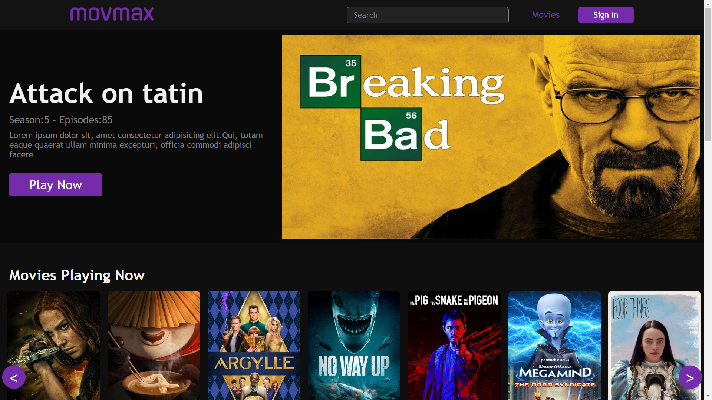
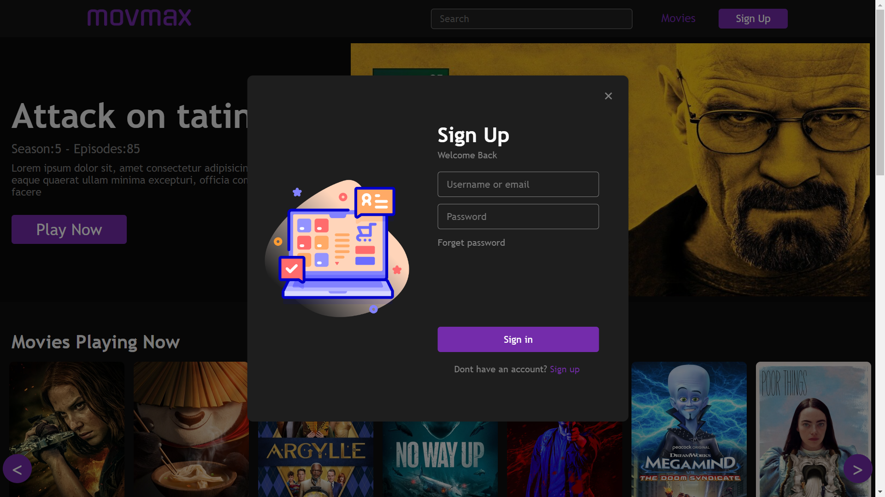
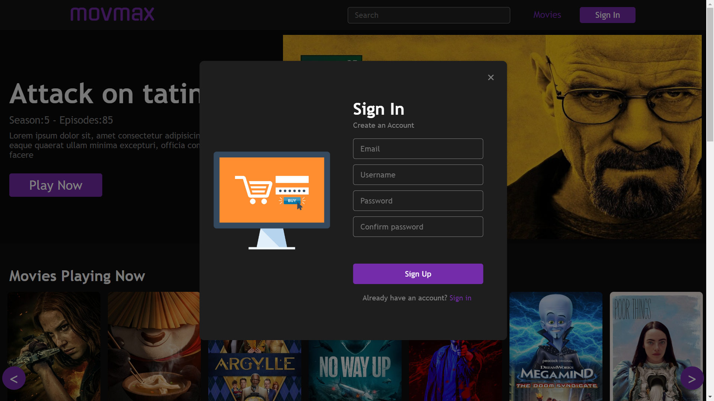
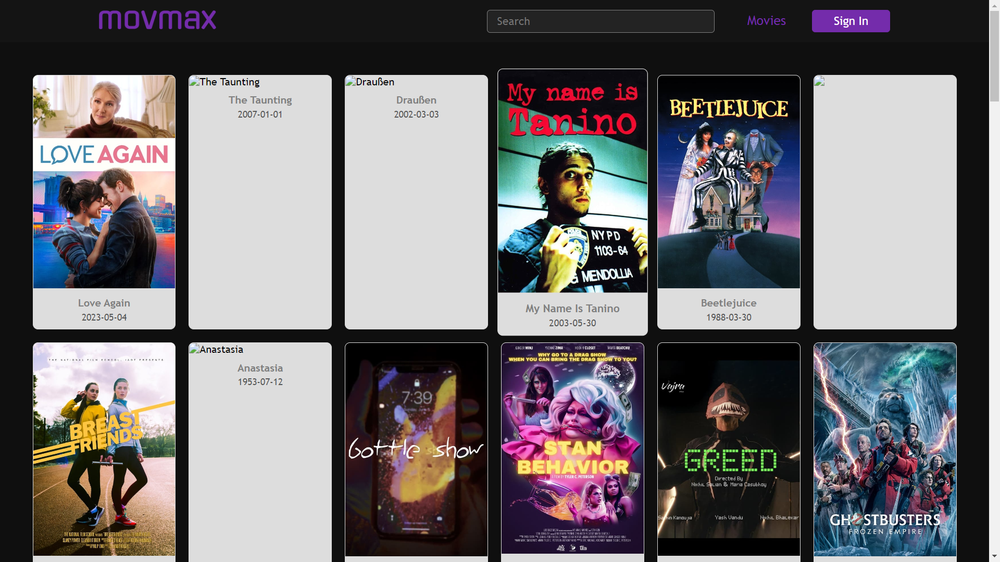
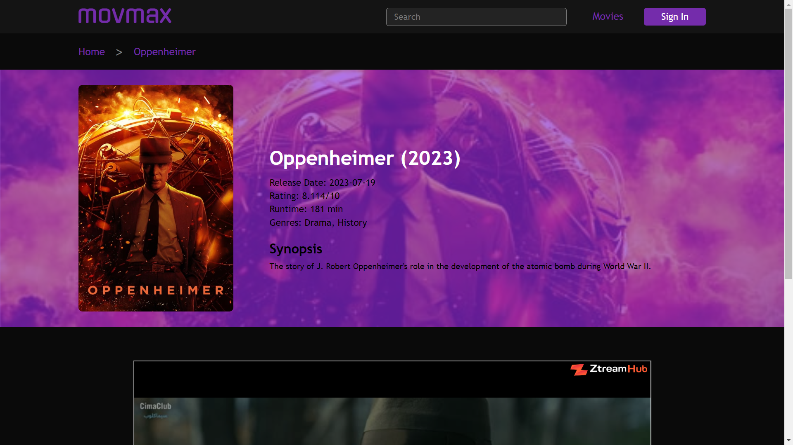
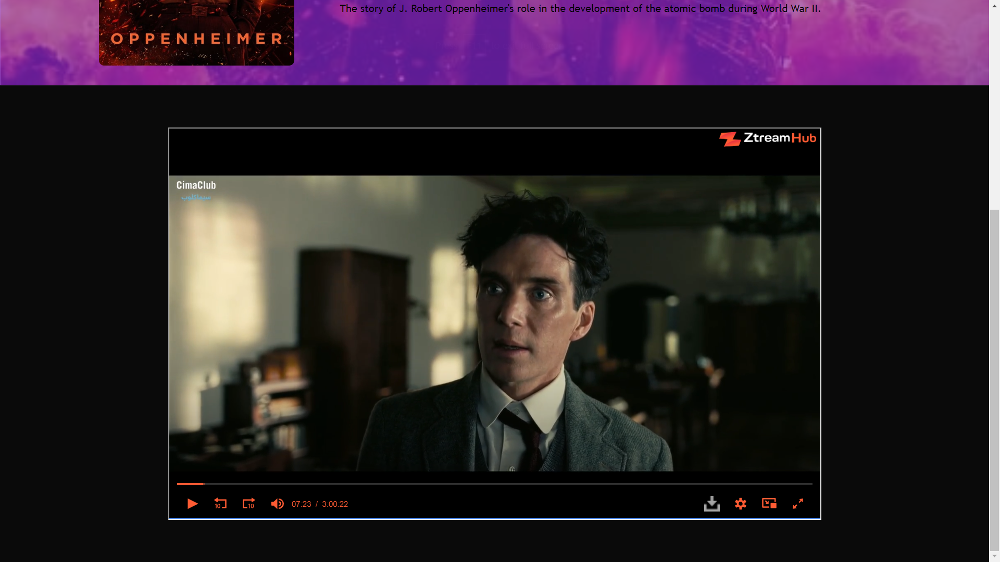

<div align="center">
  
</div>

# MovMax | Platform

## Description

MovMax is your ultimate destination for all things movies and series! Discover the latest information, reviews, and news about your favorite films and shows. Plus, enjoy a selection of movies and series available for streaming. Dive into the world of entertainment with MovMax!

## Click [here](https://movmax.onrender.com/) to view the live application.

## Table of Contents

- [MovMax | Platform](#movamx--platform)
  - [Description](#description)
  - [Click here to view the live application.](#click-here-to-view-the-live-application)
  - [Table of Contents](#table-of-contents)
  - [Tools \& Resources](#tools--resources)
  - [Screenshots](#screenshots)
  - [Home Page:](#main-page)
  - [Sign Up Page](#sign-up-page)
  - [Sign In Page:](#sign-in-page)
  - [Listing Movies Page:](#listing-movies-page)
  - [Movies Details Page:](#movies-details-page)
  - [Installation](#instalation)
  - [Installation And Start](#installation-and-start)
  - [Deployment](#deployment)
  - [Questions](#questions)


## Tools & Resources

- HTML5
- CSS3
- JavaScript
- React.js
- TailwindCSS


## Screenshots

  ### Home Page:

  


  ### Sign Up Page:

  


  ### Sign In Page:

  


  ### Listing Movies Page:

  


  ### Movies Details Page:

  


  


## Installation And Start 

```
npm install
```

```
npm run dev
```

## Deployment

Application deployed on Render  
[Live Demo](https://movmax.onrender.com/)


## Questions

Contact me by email
Email: [anasszarioh10@gmail.com](mailto:anasszarioh10@gmail.com)
